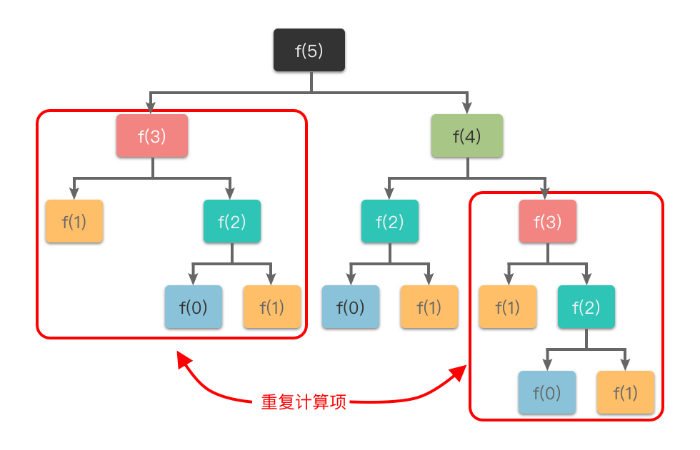

# 动态优化基础
<mark>*递推：自底向上*<mark>

动态优化：通过把原问题分解为相对简单的子问题，先求解子问题，再由子问题的解而得到原问题的解。

核心思想：

1. 把「原问题」分解为「若干个重叠的子问题」，每个子问题的求解过程都构成一个「阶段」。在完成一个阶段的计算之后，动态规划方法才会执行下一个阶段的计算。
2. 在求解子问题的过程中，按照「自顶向下的记忆化搜索方法」或者「自底向上的递推方法」求解出「子问题的解」，把结果存储在表格中，当需要再次求解此子问题时，直接从表格中查询该子问题的解，从而避免了大量的重复计算。

例子：斐波那契数列

```python
class Solution:
    def fib(self, n: int) -> int:
        """
        使用动态规划（自底向上）方法计算斐波那契数列的第 n 项。
        状态定义：dp[i] 表示第 i 项斐波那契数的值。
        初始状态：dp[0] = 0, dp[1] = 1
        状态转移：dp[i] = dp[i-1] + dp[i-2]
        """
        if n == 0:
            return 0  # 特判 n = 0
        if n == 1:
            return 1  # 特判 n = 1

        # 初始化 dp 数组，长度为 n + 1
        dp = [0] * (n + 1)
        dp[0] = 0
        dp[1] = 1

        # 递推计算每一项的值
        for i in range(2, n + 1):
            dp[i] = dp[i - 1] + dp[i - 2]  # 状态转移方程

        return dp[n]  # 返回第 n 项的值
```

# 记忆化搜索
<mark>*记忆化搜索：自顶向下*<mark>

通过存储已经遍历过的状态信息，从而避免对同一状态重复遍历的搜索算法。

为了避免重复计算，在递归的同时，我们可以使用一个缓存（数组或哈希表）来保存已经求解过的 f(k) 的结果。如上图所示，当递归调用用到 f(k) 时，先查看一下之前是否已经计算过结果，如果已经计算过，则直接从缓存中取值返回，而不用再递推下去，这样就避免了重复计算问题。

记忆化搜索解决斐波那契数列
```python
class Solution:
    def fib(self, n: int) -> int:
        # 使用数组保存已经求解过的 f(k) 的结果
        memo = [0 for _ in range(n + 1)]
        return self.my_fib(n, memo)

    def my_fib(self, n: int, memo: List[int]) -> int:
        if n == 0:
            return 0
        if n == 1:
            return 1
        
        # 已经计算过结果
        if memo[n] != 0:
            return memo[n]
        
        # 没有计算过结果
        memo[n] = self.my_fib(n - 1, memo) + self.my_fib(n - 2, memo)
        return memo[n]
```

# 背包问题
## 0-1背包问题
### 基本思路
定义状态：  
令 $dp[i][w]$ 表示前 $i$ 件物品，放入容量不超过 $w$ 的背包时可获得的最大价值

状态转移方程：  
不放第 $i−1$ 件物品：此时最大价值为 $dp[i−1][w]$，即前 $i−1$ 件物品放入容量为 $w$ 的背包的最大价值。  
放第 $i−1$ 件物品：前提是背包剩余容量足够$（w≥weight[i−1]）$，此时最大价值为 $dp[i−1][w−weight[i−1]]+value[i−1]$，即前 $i−1$ 件物品放入剩余容量为 $w−weight[i−1]$ 的背包的最大价值，再加上第 $i−1$ 件物品的价值。

```python
class Solution:
    # 思路 1：动态规划（二维数组）
    def zeroOnePackMethod1(self, weight: [int], value: [int], W: int) -> int:
        """
        0-1 背包问题二维动态规划解法
        :param weight: List[int]，每件物品的重量
        :param value: List[int]，每件物品的价值
        :param W: int，背包最大承重
        :return: int，最大可获得价值
        """
        size = len(weight)
        # dp[i][w] 表示前 i 件物品，容量不超过 W 时的最大价值
        dp = [[0] * (W + 1) for _ in range(size + 1)]

        # 遍历每一件物品
        for i in range(1, size + 1):
            # 遍历每一种可能的背包容量
            for w in range(W + 1):
                if w < weight[i - 1]:
                    # 当前物品放不下，继承上一个状态
                    dp[i][w] = dp[i - 1][w]
                else:
                    # 当前物品可选，取放与不放的最大值
                    dp[i][w] = max(
                        dp[i - 1][w],  # 不放当前物品
                        dp[i - 1][w - weight[i - 1]] + value[i - 1]  # 放当前物品
                    )
        # 返回前 size 件物品、容量为 W 时的最大价值
        return dp[size][W]
```

### 滚动数组优化
前 i 件物品的状态」只依赖于「前 i−1 件物品的状态」，与更早之前的状态无关。

$dp[w]$ 表示：在背包容量不超过 $w$ 的情况下，能够获得的最大总价值

状态转移方程：  
$$
dp[w] =
\begin{cases}
dp[w], & w < weight[i-1] \\
\max\{dp[w],\ dp[w - weight[i-1]] + value[i-1]\}, & w \ge weight[i-1]
\end{cases}
$$

```python
class Solution:
    # 思路 2：动态规划 + 滚动数组优化
    def zeroOnePackMethod2(self, weight: [int], value: [int], W: int) -> int:
        """
        0-1 背包问题的滚动数组优化解法
        :param weight: List[int]，每件物品的重量
        :param value: List[int]，每件物品的价值
        :param W: int，背包最大承重
        :return: int，背包可获得的最大价值
        """
        size = len(weight)
        # dp[w] 表示容量为 w 时背包可获得的最大价值
        dp = [0] * (W + 1)

        # 遍历每一件物品
        for i in range(size):
            # 必须逆序遍历容量，防止状态被提前覆盖
            for w in range(W, weight[i] - 1, -1):
                # 状态转移：不选第 i 件物品 or 选第 i 件物品
                # dp[w] = max(不选, 选)
                dp[w] = max(dp[w], dp[w - weight[i]] + value[i])
                # 解释：
                # dp[w]：不选第 i 件物品，价值不变
                # dp[w - weight[i]] + value[i]：选第 i 件物品，容量减少，相应加上价值

        return dp[W]
```

## 完全背包问题
### 动态规划+转移方程优化
每个物品的数量不限，所以需要再加一次循环。可以通过优化避免这次循环

与0-1背包问题的转移方程类似，  
唯一的区别在于：
+ 0-1 背包问题中，转移用的是 $dp[i−1][w−weight[i−1]]+value[i−1]$，即上一阶段的状态；
+ 完全背包问题中，转移用的是 $dp[i][w−weight[i−1]]+value[i−1]$，即当前阶段的状态
```python
class Solution:
    # 思路 2：动态规划 + 状态转移方程优化
    def completePackMethod2(self, weight: [int], value: [int], W: int):
        size = len(weight)
        dp = [[0 for _ in range(W + 1)] for _ in range(size + 1)]
        
        # 枚举前 i 种物品
        for i in range(1, size + 1):
            # 枚举背包装载重量
            for w in range(W + 1):
                # 第 i - 1 件物品装不下
                if w < weight[i - 1]:
                    # dp[i][w] 取「前 i - 1 种物品装入载重为 w 的背包中的最大价值」
                    dp[i][w] = dp[i - 1][w]
                else:
                    # dp[i][w] 取「前 i - 1 种物品装入载重为 w 的背包中的最大价值」与「前 i 种物品装入载重为 w - weight[i - 1] 的背包中，再装入 1 件第 i - 1 种物品所得的最大价值」两者中的最大值
                    dp[i][w] = max(dp[i - 1][w], dp[i][w - weight[i - 1]] + value[i - 1])
                    
        return dp[size][W]
```

### 动态规划+滚动数组优化
```python
class Solution:
    # 思路 3：动态规划 + 滚动数组优化
    def completePackMethod3(self, weight: [int], value: [int], W: int):
        size = len(weight)
        dp = [0 for _ in range(W + 1)]
        
        # 枚举前 i 种物品
        for i in range(1, size + 1):
            # 正序枚举背包装载重量
            for w in range(weight[i - 1], W + 1):
                # dp[w] 取「前 i - 1 种物品装入载重为 w 的背包中的最大价值」与「前 i 种物品装入载重为 w - weight[i - 1] 的背包中，再装入 1 件第 i - 1 种物品所得的最大价值」两者中的最大值
                dp[w] = max(dp[w], dp[w - weight[i - 1]] + value[i - 1])
                
        return dp[W]
```
0-1 背包问题滚动数组优化的代码采用了「从 $W∼weight[i−1]$ 逆序递推的方式」。
完全背包问题滚动数组优化的代码采用了「从 $weight[i−1]∼W$ 正序递推的方式」。

## 多重背包问题
### 滚动数组优化
```python
class Solution: 
    # 思路 2：动态规划 + 滚动数组优化
    def multiplePackMethod2(self, weight: [int], value: [int], count: [int], W: int):
        size = len(weight)
        dp = [0 for _ in range(W + 1)]
        
        # 枚举前 i 种物品
        for i in range(1, size + 1):
            # 逆序枚举背包装载重量（避免状态值错误）
            for w in range(W, weight[i - 1] - 1, -1):
                # 枚举第 i - 1 种物品能取个数
                for k in range(min(count[i - 1], w // weight[i - 1]) + 1):
                    # dp[w] 取所有 dp[w - k * weight[i - 1]] + k * value[i - 1] 中最大值
                    dp[w] = max(dp[w], dp[w - k * weight[i - 1]] + k * value[i - 1])
                
        return dp[W]
```
### 二进制优化
```python
class Solution:
    # 思路 3：动态规划 + 二进制优化
    def multiplePackMethod3(self, weight: [int], value: [int], count: [int], W: int):
        weight_new, value_new = [], []
        
        # 二进制优化
        for i in range(len(weight)):
            cnt = count[i]
            k = 1
            while k <= cnt:
                cnt -= k
                weight_new.append(weight[i] * k)
                value_new.append(value[i] * k)
                k *= 2
            if cnt > 0:
                weight_new.append(weight[i] * cnt)
                value_new.append(value[i] * cnt)
        
        dp = [0 for _ in range(W + 1)]
        size = len(weight_new)
        
        # 枚举前 i 种物品
        for i in range(1, size + 1):
            # 逆序枚举背包装载重量（避免状态值错误）
            for w in range(W, weight_new[i - 1] - 1, -1):
                # dp[w] 取「前 i - 1 件物品装入载重为 w 的背包中的最大价值」与「前 i - 1 件物品装入载重为 w - weight_new[i - 1] 的背包中，再装入第 i - 1 物品所得的最大价值」两者中的最大值
                dp[w] = max(dp[w], dp[w - weight_new[i - 1]] + value_new[i - 1])
                    
        return dp[W]
```

## 混合背包问题
### 二进制优化
混合背包问题：有 $n$ 种物品和一个最多能装重量为 $W$ 的背包，第 i$ 种物品的重量为 $weight[i]$，价值为 $value[i]$，件数为 $count[i]$。其中：  
1. 当 $count[i]=−1$ 时，代表该物品只有 $1$ 件。
2. 当 $count[i]=0$ 时，代表该物品有无限件。
3. 当 $count[i]>0$ 时，代表该物品有 $count[i]$ 件。

思路：先将「多重背包问题」转换为「0-1 背包问题」，然后直接再区分是「0-1 背包问题」还是「完全背包问题」
```python
class Solution:
    def mixedPackMethod1(self, weight: [int], value: [int], count: [int], W: int):
        weight_new, value_new, count_new = [], [], []
        
        # 二进制优化
        for i in range(len(weight)):
            cnt = count[i]
            # 多重背包问题，转为 0-1 背包问题
            if cnt > 0:
                k = 1
                while k <= cnt:
                    cnt -= k
                    weight_new.append(weight[i] * k)
                    value_new.append(value[i] * k)
                    count_new.append(1)
                    k *= 2
                if cnt > 0:
                    weight_new.append(weight[i] * cnt)
                    value_new.append(value[i] * cnt)
                    count_new.append(1)
            # 0-1 背包问题，直接添加
            elif cnt == -1:
                weight_new.append(weight[i])
                value_new.append(value[i])
                count_new.append(1)
            # 完全背包问题，标记并添加
            else:
                weight_new.append(weight[i])
                value_new.append(value[i])
                count_new.append(0)
                
        dp = [0 for _ in range(W + 1)]
        size = len(weight_new)
    
        # 枚举前 i 种物品
        for i in range(1, size + 1):
            # 0-1 背包问题
            if count_new[i - 1] == 1:
                # 逆序枚举背包装载重量（避免状态值错误）
                for w in range(W, weight_new[i - 1] - 1, -1):
                    # dp[w] 取「前 i - 1 件物品装入载重为 w 的背包中的最大价值」与「前 i - 1 件物品装入载重为 w - weight_new[i - 1] 的背包中，再装入第 i - 1 物品所得的最大价值」两者中的最大值
                    dp[w] = max(dp[w], dp[w - weight_new[i - 1]] + value_new[i - 1])
            # 完全背包问题
            else:
                # 正序枚举背包装载重量
                for w in range(weight_new[i - 1], W + 1):
                    # dp[w] 取「前 i - 1 种物品装入载重为 w 的背包中的最大价值」与「前 i 种物品装入载重为 w - weight[i - 1] 的背包中，再装入 1 件第 i - 1 种物品所得的最大价值」两者中的最大值
                    dp[w] = max(dp[w], dp[w - weight_new[i - 1]] + value_new[i - 1])
                    
        return dp[W]
```

## 分组背包问题
>分组背包问题：有 $n$ 组物品和一个最多能装重量为 $W$ 的背包，第 $i$ 组物品的件数为 $group\_count[i]$，第 $i$ 组的第 $j$ 个物品重量为 $weight[i][j]$，价值为 $value[i][j]$。每组物品中最多只能选择 $1$ 件物品装入背包。请问在总重量不超过背包载重上限的情况下，能装入背包的最大价值是多少？
### 滚动数组优化
```python
class Solution:
    # 思路 2：动态规划 + 滚动数组优化
    def groupPackMethod2(self, group_count: [int], weight: [[int]], value: [[int]], W: int):
        size = len(group_count)
        dp = [0 for _ in range(W + 1)]
        
        # 枚举前 i 组物品
        for i in range(1, size + 1):
            # 逆序枚举背包装载重量
            for w in range(W, -1, -1):
                # 枚举第 i - 1 组物品能取个数
                for k in range(group_count[i - 1]):
                    if w >= weight[i - 1][k]:
                        # dp[w] 取所有 dp[w - weight[i - 1][k]] + value[i - 1][k] 中最大值
                        dp[w] = max(dp[w], dp[w - weight[i - 1][k]] + value[i - 1][k])
                        
        return dp[W]
```

## 二维费用背包问题
>二维费用背包问题：有 $n$ 件物品和有一个最多能装重量为 $W$、容量为 $V$ 的背包。第 $i$ 件物品的重量为 $weight[i]$，体积为 $volume[i]$，价值为 $value[i]$，每件物品有且只有 $1$ 件。请问在总重量不超过背包载重上限、容量上限的情况下，能装入背包的最大价值是多少？
### 滚动数组优化
```python
class Solution:        
    # 思路 2：动态规划 + 滚动数组优化
    def twoDCostPackMethod2(self, weight: [int], volume: [int], value: [int], W: int, V: int):
        size = len(weight)
        dp = [[0 for _ in range(V + 1)] for _ in range(W + 1)]
        
        # 枚举前 i 组物品
        for i in range(1, N + 1):
            # 逆序枚举背包装载重量
            for w in range(W, weight[i - 1] - 1, -1):
                # 逆序枚举背包装载容量
                for v in range(V, volume[i - 1] - 1, -1):
                    # dp[w][v] 取所有 dp[w - weight[i - 1]][v - volume[i - 1]] + value[i - 1] 中最大值
                    dp[w][v] = max(dp[w][v], dp[w - weight[i - 1]][v - volume[i - 1]] + value[i - 1])
                    
        return dp[W][V]
```